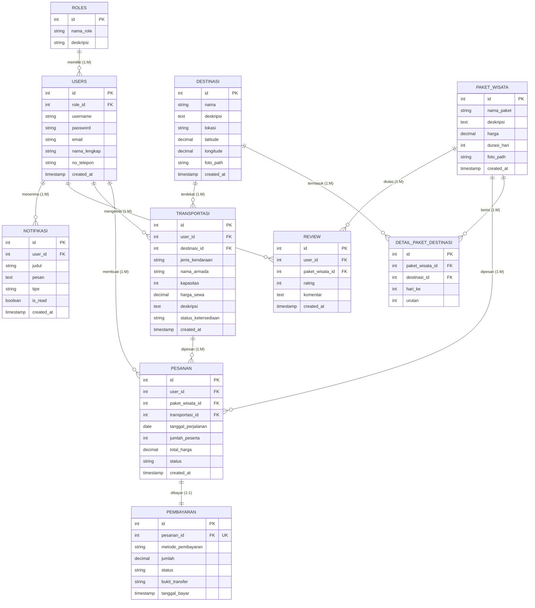
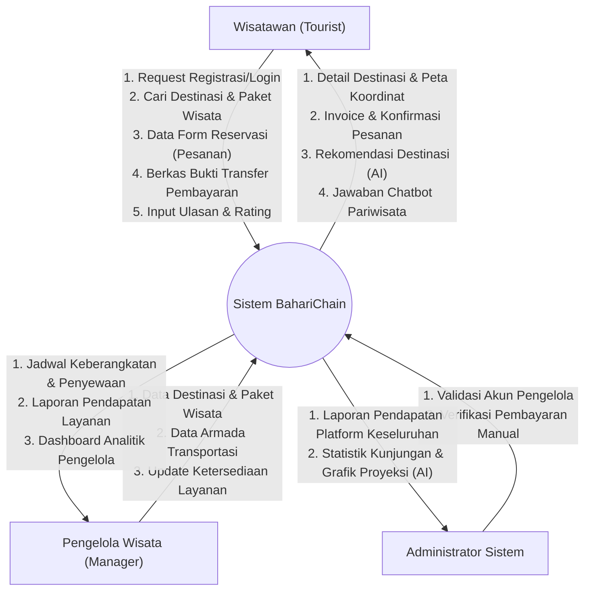
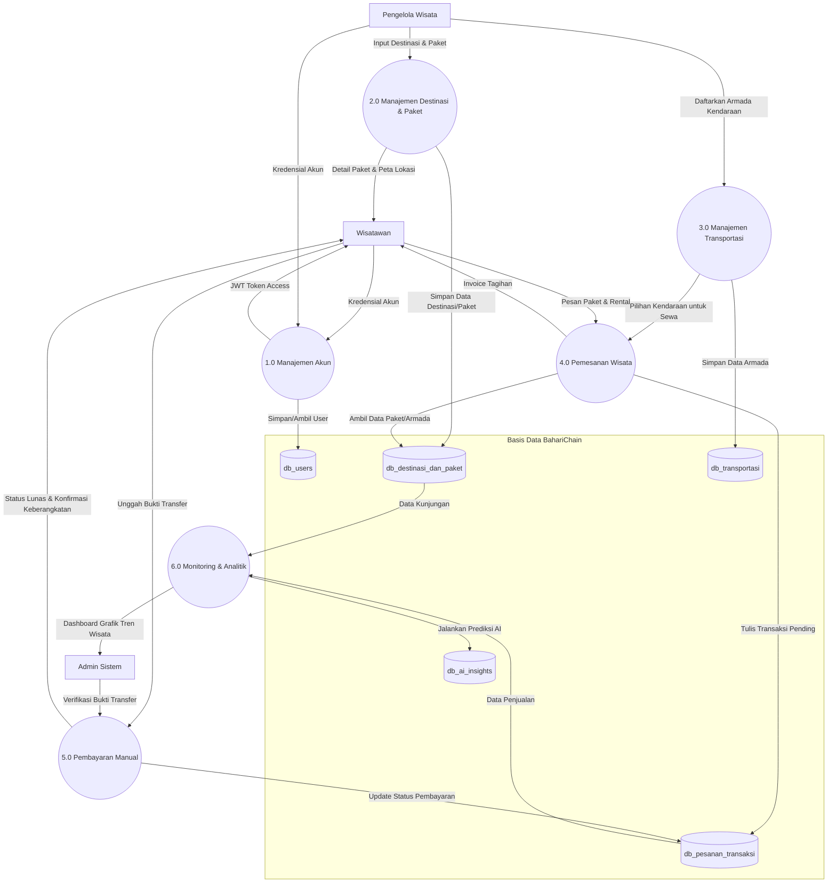
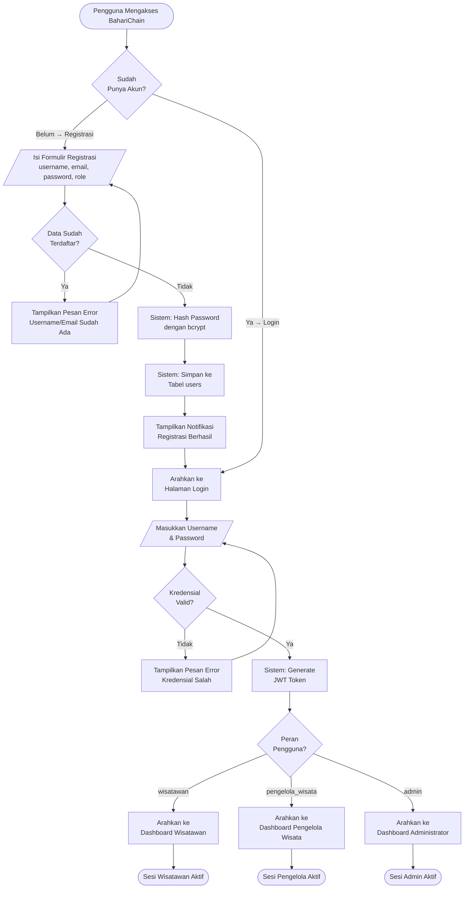
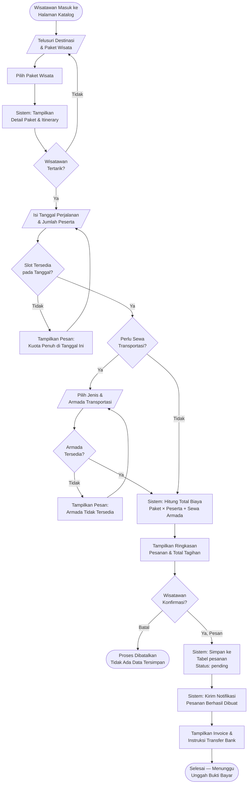
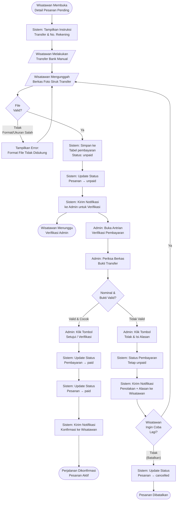
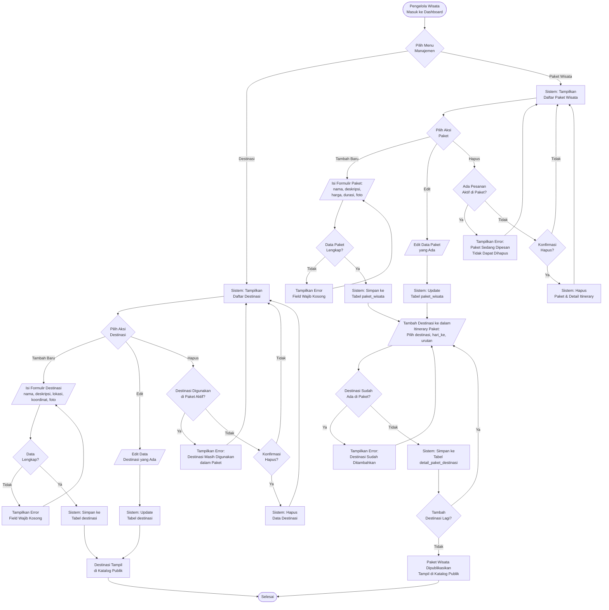
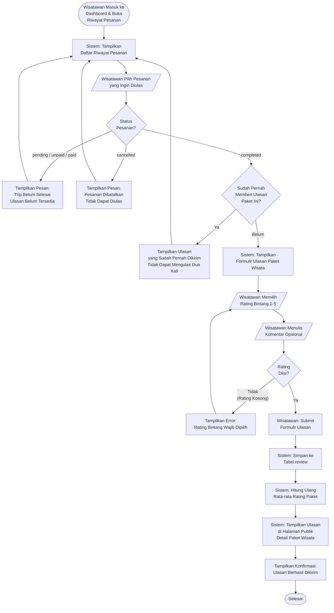

# DOKUMEN PERANCANGAN PERANGKAT LUNAK (SOFTWARE DESIGN DOCUMENT)
## SISTEM BAHARICHAIN: PLATFORM RESERVASI PARIWISATA BAHARI

**Versi:** 3.0 (Final Academic Prototype)  
**Tanggal:** 8 Juni 2026  
**Status:** DRAFT (Menunggu Persetujuan)  

---

## 1. Analisis Kebutuhan Sistem

Sistem **BahariChain** dirancang sebagai platform reservasi pariwisata bahari untuk lingkup akademis. Sistem ini mengintegrasikan informasi destinasi pariwisata, paket liburan, serta transportasi penunjang, yang dikelola secara langsung oleh Pengelola Wisata dan diverifikasi oleh Administrator.

### 1.1 Kebutuhan Fungsional (Functional Requirements)

1. **Manajemen Pengguna (User Management)**
   - Registrasi dan login pengguna menggunakan arsitektur **Role-Based Access Control (RBAC)** untuk 3 peran utama: **Wisatawan**, **Pengelola Wisata (Tourism Manager)**, dan **Administrator (Admin)**.
   - Manajemen profil pengguna dan hak akses portal.
2. **Manajemen Destinasi Wisata (Destination Management)**
   - Pengelola Wisata dapat mengelola data objek destinasi wisata bahari (tambah, ubah, hapus, unggah foto).
   - Wisatawan dapat menjelajahi daftar destinasi beserta rincian informasi dan lokasinya.
3. **Manajemen Paket Wisata (Tourism Package Management)**
   - Pengelola Wisata dapat menyusun paket wisata terpadu yang mencakup satu atau beberapa destinasi wisata bahari.
   - Manajemen nama paket, deskripsi agenda (itinerary), durasi, dan tarif per pax.
4. **Manajemen Jasa Transportasi (Transportation Management)**
   - Pengelola Wisata dapat mendaftarkan armada transportasi lokal (seperti perahu wisata, shuttle bus, mobil sewaan).
   - Pengelolaan kapasitas penumpang, tarif sewa, rute, dan status ketersediaan armada.
5. **Manajemen Reservasi/Pesanan (Reservation Management)**
   - Wisatawan dapat membuat pesanan (`pesanan`) paket wisata tertentu dan menambahkan sewa transportasi pendukung (opsional) dalam satu kali check-out.
   - Sistem mencatat detail pesanan (tanggal perjalanan, jumlah peserta, total tarif, dan status).
6. **Pembayaran Manual & Verifikasi (Manual Payment Verification)**
   - Wisatawan mengunggah berkas gambar bukti transfer bank untuk mengonfirmasi pesanan.
   - Admin memvalidasi bukti transfer secara manual dan mengubah status pembayaran serta pesanan menjadi Lunas (`paid`).
7. **Sistem Ulasan dan Rating (Review & Rating)**
   - Wisatawan dapat memberikan bintang (1-5) dan komentar ulasan tertulis pada paket wisata yang telah mereka selesaikan perjalanannya.
8. **Dashboard & Pelaporan (Dashboard & Reporting)**
   - Portal Admin: Statistik pemesanan paket terpopuler, pendapatan platform, dan verifikasi bukti bayar.
   - Portal Pengelola Wisata: Grafik sewa armada, jumlah kunjungan wisatawan pada paket mereka, dan laporan pendapatan.
9. **Sistem Notifikasi**
   - Pengiriman notifikasi otomatis kepada pengguna terkait perubahan status transaksi keberangkatan.

### 1.2 Kebutuhan Non-Fungsional (Non-Functional Requirements)

1. **Keamanan (Security)**
   - Autentikasi API RESTful dilindungi oleh **JSON Web Token (JWT)**.
   - Enkripsi kata sandi pengguna menggunakan hashing bcrypt.
2. **Performa (Performance)**
   - Waktu respons pemuatan halaman rata-rata kurang dari 3 detik.
3. **Skalabilitas & Integritas Data**
   - Normalisasi database relasional 3NF untuk menjamin tidak adanya anomali data pesanan.
4. **Ketersediaan (Availability)**
   - Target ketersediaan (availability) sistem minimal 99%.

---

## 2. Use Case Diagram & Deskripsi Use Case

### 2.1 Use Case Diagram (Mermaid)

```mermaid
usecaseDiagram
    actor Wisatawan as "Wisatawan (Tourist)"
    actor Pengelola as "Pengelola Wisata (Manager)"
    actor Admin as "Administrator Sistem"

    rectangle "Sistem BahariChain" {
        usecase UC_Auth as "Registrasi & Login Akun"
        usecase UC_Browse as "Eksplorasi Destinasi & Paket Wisata"
        usecase UC_Reserve as "Melakukan Reservasi (Pesanan)"
        usecase UC_Payment as "Unggah Bukti Transfer"
        usecase UC_Verify as "Verifikasi Pembayaran Manual"
        usecase UC_Manage_Dest as "Kelola Destinasi & Paket Wisata"
        usecase UC_Manage_Transport as "Kelola Jasa Transportasi"
        usecase UC_Review as "Kirim Ulasan & Rating"
        usecase UC_Dashboard as "Lihat Dashboard & Laporan"
        usecase UC_Chatbot as "Konsultasi Chatbot Pariwisata"
    }

    %% Hubungan Aktor ke Use Case
    Wisatawan --> UC_Auth
    Wisatawan --> UC_Browse
    Wisatawan --> UC_Reserve
    Wisatawan --> UC_Payment
    Wisatawan --> UC_Review
    Wisatawan --> UC_Chatbot

    Pengelola --> UC_Auth
    Pengelola --> UC_Manage_Dest
    Pengelola --> UC_Manage_Transport
    Pengelola --> UC_Dashboard

    Admin --> UC_Auth
    Admin --> UC_Verify
    Admin --> UC_Dashboard
```

### 2.2 Deskripsi Use Case Utama (User Journey)

#### Use Case 1: Eksplorasi Destinasi & Paket (UC_Browse)
- **Aktor**: Wisatawan
- **Deskripsi**: Wisatawan menjelajahi destinasi bahari dan paket perjalanan untuk mencari itinerary yang sesuai.
- **Alur**: Wisatawan membuka katalog $\rightarrow$ mencari berdasarkan kata kunci $\rightarrow$ melihat destinasi yang termasuk di dalam paket $\rightarrow$ membaca ulasan wisatawan lain.

#### Use Case 2: Melakukan Reservasi / Pesanan (UC_Reserve)
- **Aktor**: Wisatawan
- **Deskripsi**: Wisatawan memesan paket wisata pilihan dan memesan rental transportasi (opsional) untuk tanggal tertentu.
- **Alur**: Wisatawan mengisi tanggal perjalanan, jumlah peserta, dan memilih jenis transportasi $\rightarrow$ sistem menghitung harga akhir dan menyimpan data ke tabel `pesanan` dengan status `'pending'`.

#### Use Case 3: Unggah Bukti Transfer (UC_Payment)
- **Aktor**: Wisatawan
- **Deskripsi**: Wisatawan menyertakan bukti transfer bank manual untuk melunasi tagihan pesanan.
- **Alur**: Wisatawan mengunggah file bukti transfer $\rightarrow$ sistem menyimpan catatan pada tabel `pembayaran` dengan status `'unpaid'` (menunggu verifikasi).

#### Use Case 4: Verifikasi Pembayaran Manual (UC_Verify)
- **Aktor**: Admin
- **Deskripsi**: Admin meneliti bukti pembayaran yang diunggah dan memperbarui status pesanan.
- **Alur**: Admin memeriksa file bukti bayar $\rightarrow$ memvalidasi kecocokan dengan nilai tagihan $\rightarrow$ menyetujui transaksi $\rightarrow$ status pembayaran dan pesanan diperbarui menjadi `'paid'` (Travel Confirmed).

#### Use Case 5: Kirim Ulasan & Rating (UC_Review)
- **Aktor**: Wisatawan
- **Deskripsi**: Memberikan rating kepuasan setelah trip selesai dilaksanakan.
- **Alur**: Wisatawan memilih riwayat pesanan selesai $\rightarrow$ memberikan rating bintang dan menulis komentar $\rightarrow$ sistem menyimpan data ke tabel `review`.

---

## 3. Perancangan Basis Data (Conceptual Database Design)

Skema database akademik BahariChain terdiri atas **10 tabel utama** yang telah dinormalisasi (3NF).

### 1. Entitas: Roles (Peran Pengguna)
* **Nama Tabel**: `roles`
* **Primary Key**: `id` (INT, Auto Increment)
* **Daftar Kolom**:
  | Nama Kolom | Tipe Data | Constraints | Deskripsi |
  | :--- | :--- | :--- | :--- |
  | `id` | INT | PRIMARY KEY, AUTO_INCREMENT, NOT NULL | ID unik peran. |
  | `nama_role` | VARCHAR(30) | UNIQUE, NOT NULL | Nama peran (`'admin'`, `'pengelola_wisata'`, `'wisatawan'`). |
  | `deskripsi` | VARCHAR(255) | NULLABLE | Penjelasan peran. |

### 2. Entitas: Users (Pengguna)
* **Nama Tabel**: `users`
* **Primary Key**: `id` (INT, Auto Increment)
* **Foreign Key**: 
  - `role_id` merujuk ke `roles(id)` (ON DELETE RESTRICT, ON UPDATE CASCADE)
* **Daftar Kolom**:
  | Nama Kolom | Tipe Data | Constraints | Deskripsi |
  | :--- | :--- | :--- | :--- |
  | `id` | INT | PRIMARY KEY, AUTO_INCREMENT, NOT NULL | ID unik pengguna. |
  | `role_id` | INT | FOREIGN KEY, NOT NULL | Rujukan ke entitas peran (Roles). |
  | `username` | VARCHAR(50) | UNIQUE, NOT NULL | Nama pengguna unik. |
  | `password` | VARCHAR(255) | NOT NULL | Password terenkripsi (bcrypt). |
  | `email` | VARCHAR(100) | UNIQUE, NOT NULL | Email unik pengguna. |
  | `nama_lengkap`| VARCHAR(100) | NULLABLE | Nama lengkap pengguna. |
  | `no_telepon` | VARCHAR(20) | NULLABLE | Nomor kontak aktif. |
  | `created_at` | TIMESTAMP | DEFAULT CURRENT_TIMESTAMP, NOT NULL | Waktu registrasi akun. |

### 3. Entitas: Destinasi (Destinasi Wisata)
* **Nama Tabel**: `destinasi`
* **Primary Key**: `id` (INT, Auto Increment)
* **Daftar Kolom**:
  | Nama Kolom | Tipe Data | Constraints | Deskripsi |
  | :--- | :--- | :--- | :--- |
  | `id` | INT | PRIMARY KEY, AUTO_INCREMENT, NOT NULL | ID unik destinasi. |
  | `nama` | VARCHAR(100) | NOT NULL | Nama objek wisata bahari. |
  | `deskripsi` | TEXT | NULLABLE | Penjelasan daya tarik destinasi. |
  | `lokasi` | VARCHAR(255) | NOT NULL | Wilayah administrasi destinasi. |
  | `latitude` | DECIMAL(10, 8) | NULLABLE | Peta: garis lintang. |
  | `longitude` | DECIMAL(11, 8) | NULLABLE | Peta: garis bujur. |
  | `foto_path` | VARCHAR(255) | NULLABLE | Berkas foto destinasi wisata. |
  | `created_at` | TIMESTAMP | DEFAULT CURRENT_TIMESTAMP, NOT NULL | Tanggal penambahan destinasi. |

### 4. Entitas: Paket_Wisata (Paket Liburan)
* **Nama Tabel**: `paket_wisata`
* **Primary Key**: `id` (INT, Auto Increment)
* **Daftar Kolom**:
  | Nama Kolom | Tipe Data | Constraints | Deskripsi |
  | :--- | :--- | :--- | :--- |
  | `id` | INT | PRIMARY KEY, AUTO_INCREMENT, NOT NULL | ID unik paket wisata. |
  | `nama_paket` | VARCHAR(150) | NOT NULL | Nama penawaran paket. |
  | `deskripsi` | TEXT | NULLABLE | Itinerary perjalanan dan rincian agenda. |
  | `harga` | DECIMAL(12, 2) | NOT NULL, >= 0 | Tarif dasar per pax. |
  | `durasi_hari`| INT | NOT NULL, DEFAULT 1, > 0 | Durasi trip (satuan hari). |
  | `foto_path` | VARCHAR(255) | NULLABLE | Gambar representasi paket. |
  | `created_at` | TIMESTAMP | DEFAULT CURRENT_TIMESTAMP, NOT NULL | Tanggal rilis paket wisata. |

### 5. Entitas: Detail_Paket_Destinasi (Junction M:N Paket & Destinasi)
* **Nama Tabel**: `detail_paket_destinasi`
* **Primary Key**: `id` (INT, Auto Increment)
* **Foreign Key**:
  - `paket_wisata_id` merujuk ke `paket_wisata(id)` (ON DELETE CASCADE, ON UPDATE CASCADE)
  - `destinasi_id` merujuk ke `destinasi(id)` (ON DELETE CASCADE, ON UPDATE CASCADE)
* **Daftar Kolom**:
  | Nama Kolom | Tipe Data | Constraints | Deskripsi |
  | :--- | :--- | :--- | :--- |
  | `id` | INT | PRIMARY KEY, AUTO_INCREMENT, NOT NULL | ID unik detail paket destinasi. |
  | `paket_wisata_id`| INT | FOREIGN KEY, NOT NULL | Rujukan paket wisata terkait. |
  | `destinasi_id`| INT | FOREIGN KEY, NOT NULL | Rujukan objek destinasi yang termasuk. |
  | `hari_ke` | INT | NOT NULL, DEFAULT 1, > 0 | Penanda kunjungan hari ke-X (itinerary). |
  | `urutan` | INT | NOT NULL, DEFAULT 1, > 0 | Urutan rute perjalanan pada hari tersebut. |
* **Constraints**:
  - `UNIQUE(paket_wisata_id, destinasi_id)`: Mencegah duplikasi destinasi pada satu paket.

### 6. Entitas: Transportasi (Armada Transportasi)
* **Nama Tabel**: `transportasi`
* **Primary Key**: `id` (INT, Auto Increment)
* **Foreign Key**:
  - `user_id` merujuk ke `users(id)` (ON DELETE CASCADE, ON UPDATE CASCADE)
  - `destinasi_id` merujuk ke `destinasi(id)` (ON DELETE SET NULL, ON UPDATE CASCADE)
* **Daftar Kolom**:
  | Nama Kolom | Tipe Data | Constraints | Deskripsi |
  | :--- | :--- | :--- | :--- |
  | `id` | INT | PRIMARY KEY, AUTO_INCREMENT, NOT NULL | ID unik armada transportasi. |
  | `user_id` | INT | FOREIGN KEY, NOT NULL | Akun Pengelola Wisata yang mendaftarkan armada. |
  | `destinasi_id`| INT | FOREIGN KEY, NULLABLE | Lokasi pos layanan terdekat objek wisata. |
  | `jenis_kendaraan` | ENUM | `'motor'`, `'mobil'`, `'shuttle_bus'`, `'perahu_wisata'`, `'lainnya'`, NOT NULL | Kategori transportasi. |
  | `nama_armada` | VARCHAR(100) | NOT NULL | Label plat atau nama kendaraan. |
  | `kapasitas` | INT | NOT NULL, > 0 | Jumlah maksimal muatan penumpang. |
  | `harga_sewa` | DECIMAL(12, 2) | NOT NULL, >= 0 | Tarif sewa kendaraan. |
  | `deskripsi` | TEXT | NULLABLE | Deskripsi fasilitas armada. |
  | `status_ketersediaan`| ENUM | `'tersedia'`, `'habis_dipesan'`, `'nonaktif'`, DEFAULT `'tersedia'`, NOT NULL | Status ketersediaan sewa armada. |
  | `created_at` | TIMESTAMP | DEFAULT CURRENT_TIMESTAMP, NOT NULL | Tanggal pendaftaran armada. |

### 7. Entitas: Pesanan (Data Reservasi Transaksi)
* **Nama Tabel**: `pesanan`
* **Primary Key**: `id` (INT, Auto Increment)
* **Foreign Key**:
  - `user_id` merujuk ke `users(id)` (ON DELETE CASCADE, ON UPDATE CASCADE)
  - `paket_wisata_id` merujuk ke `paket_wisata(id)` (ON DELETE RESTRICT, ON UPDATE CASCADE)
  - `transportasi_id` merujuk ke `transportasi(id)` (ON DELETE SET NULL, ON UPDATE CASCADE)
* **Daftar Kolom**:
  | Nama Kolom | Tipe Data | Constraints | Deskripsi |
  | :--- | :--- | :--- | :--- |
  | `id` | INT | PRIMARY KEY, AUTO_INCREMENT, NOT NULL | ID unik pesanan (Invoice ID). |
  | `user_id` | INT | FOREIGN KEY, NOT NULL | Akun Wisatawan pemesan. |
  | `paket_wisata_id`| INT | FOREIGN KEY, NOT NULL | Paket wisata yang dipesan. |
  | `transportasi_id`| INT | FOREIGN KEY, NULLABLE | Armada transportasi sewaan (opsional). |
  | `tanggal_perjalanan`| DATE | NOT NULL | Tanggal keberangkatan pariwisata. |
  | `jumlah_peserta`| INT | NOT NULL, DEFAULT 1, > 0 | Total peserta perjalanan wisata. |
  | `total_harga` | DECIMAL(12, 2) | NOT NULL, >= 0 | Total tarif tagihan (derived: `paket_wisata.harga * jumlah_peserta` + `transportasi.harga_sewa` jika disewa). |
  | `status` | ENUM | `'pending'`, `'unpaid'`, `'paid'`, `'completed'`, `'cancelled'`, DEFAULT `'pending'`, NOT NULL | Status perjalanan proses pesanan. |
  | `created_at` | TIMESTAMP | DEFAULT CURRENT_TIMESTAMP, NOT NULL | Waktu pesanan disimpan. |

### 8. Entitas: Pembayaran (Verifikasi Bukti Transfer)
* **Nama Tabel**: `pembayaran`
* **Primary Key**: `id` (INT, Auto Increment)
* **Foreign Key**:
  - `pesanan_id` merujuk ke `pesanan(id)` (ON DELETE CASCADE, ON UPDATE CASCADE)
* **Daftar Kolom**:
  | Nama Kolom | Tipe Data | Constraints | Deskripsi |
  | :--- | :--- | :--- | :--- |
  | `id` | INT | PRIMARY KEY, AUTO_INCREMENT, NOT NULL | ID unik data pembayaran. |
  | `pesanan_id` | INT | FOREIGN KEY, UNIQUE, NOT NULL | Relasi 1:1 ke pesanan utama. |
  | `metode_pembayaran`| VARCHAR(50) | NOT NULL | Pilihan transfer bank manual (e.g. `'Transfer BCA'`). |
  | `jumlah` | DECIMAL(12, 2) | NOT NULL, >= 0 | Nominal dana yang ditransfer. |
  | `status` | ENUM | `'unpaid'`, `'paid'`, `'refunded'`, DEFAULT `'unpaid'`, NOT NULL | Status verifikasi keuangan invoice. |
  | `bukti_transfer`| VARCHAR(255) | NULLABLE | Berkas foto struk bukti transfer pembayaran. |
  | `tanggal_bayar`| TIMESTAMP | NULLABLE | Tanggal verifikasi disetujui Admin. |

### 9. Entitas: Review (Ulasan Rating Paket)
* **Nama Tabel**: `review`
* **Primary Key**: `id` (INT, Auto Increment)
* **Foreign Key**:
  - `user_id` merujuk ke `users(id)` (ON DELETE CASCADE, ON UPDATE CASCADE)
  - `paket_wisata_id` merujuk ke `paket_wisata(id)` (ON DELETE CASCADE, ON UPDATE CASCADE)
* **Daftar Kolom**:
  | Nama Kolom | Tipe Data | Constraints | Deskripsi |
  | :--- | :--- | :--- | :--- |
  | `id` | INT | PRIMARY KEY, AUTO_INCREMENT, NOT NULL | ID unik review. |
  | `user_id` | INT | FOREIGN KEY, NOT NULL | Wisatawan yang memberikan rating ulasan. |
  | `paket_wisata_id`| INT | FOREIGN KEY, NOT NULL | Paket pariwisata bahari yang diulas. |
  | `rating` | INT | NOT NULL, CHECK (rating BETWEEN 1 AND 5) | Skala bintang 1 sampai 5. |
  | `komentar` | TEXT | NULLABLE | Catatan ulasan tertulis. |
  | `created_at` | TIMESTAMP | DEFAULT CURRENT_TIMESTAMP, NOT NULL | Waktu posting ulasan. |

### 10. Entitas: Notifikasi (Pesan Pemberitahuan)
* **Nama Tabel**: `notifikasi`
* **Primary Key**: `id` (INT, Auto Increment)
* **Foreign Key**:
  - `user_id` merujuk ke `users(id)` (ON DELETE CASCADE, ON UPDATE CASCADE)
* **Daftar Kolom**:
  | Nama Kolom | Tipe Data | Constraints | Deskripsi |
  | :--- | :--- | :--- | :--- |
  | `id` | INT | PRIMARY KEY, AUTO_INCREMENT, NOT NULL | ID unik notifikasi. |
  | `user_id` | INT | FOREIGN KEY, NOT NULL | Pengguna penerima notifikasi. |
  | `judul` | VARCHAR(100) | NOT NULL | Judul singkat notifikasi. |
  | `pesan` | TEXT | NOT NULL | Deskripsi detail pemberitahuan. |
  | `tipe` | ENUM | `'info'`, `'transaksi'`, `'alert'`, DEFAULT `'info'`, NOT NULL | Kategori pesan. |
  | `is_read` | BOOLEAN | DEFAULT FALSE, NOT NULL | Penanda notifikasi dibaca (TRUE/FALSE). |
  | `created_at` | TIMESTAMP | DEFAULT CURRENT_TIMESTAMP, NOT NULL | Tanggal notifikasi dikirim. |

---

## 4. Perancangan Entity Relationship Diagram (ERD)

ERD memetakan dependensi relasi utama antar 10 entitas di sistem BahariChain.



---

## 5. Perancangan Data Flow Diagram (DFD)

### 5.1 DFD Level 0 (Context Diagram)

Diagram konteks memetakan batasan sistem platform reservasi pariwisata bahari BahariChain.



### 5.2 DFD Level 1 (Proses Utama)

Membagi sistem menjadi 6 proses utama dengan data store masing-masing.



---

## 6. Perancangan UI/UX & Sitemap

Sitemap mendefinisikan navigasi antarmuka klien dan portal dashboard khusus tiap aktor.

```mermaid
graph TD
    Home[Home / Landing Page]
    
    %% Halaman Utama Publik
    Home --> Destinasi[Destinasi Wisata]
    Home --> Paket[Paket Wisata]
    Home --> Transportasi[Pilihan Transportasi]
    
    %% Autentikasi
    Home --> Login[Login / Masuk]
    Home --> Registrasi[Registrasi Akun]
    
    %% Dashboard (Hanya setelah Login)
    Login --> Dashboards{Portal Dashboard}
    Dashboards --> Dash_User[Dashboard Wisatawan]
    Dashboards --> Dash_Pengelola[Dashboard Pengelola Wisata]
    Dashboards --> Dash_Admin[Dashboard Admin Sistem]
    
    %% Rincian Dashboard Wisatawan
    Dash_User --> User_Profil[Kelola Profil & ID]
    Dash_User --> User_Reservasi[Riwayat Pesanan & Tiket]
    Dash_User --> User_Chatbot[Asisten Chatbot Pariwisata]
    
    %% Rincian Dashboard Pengelola Wisata
    Dash_Pengelola --> Pengelola_Destinasi[Kelola Destinasi & Paket]
    Dash_Pengelola --> Pengelola_Transport[Kelola Armada Kendaraan]
    Dash_Pengelola --> Pengelola_Order[Jadwal & Riwayat Pesanan]
    
    %% Rincian Dashboard Admin
    Dash_Admin --> Admin_Mitra[Verifikasi Akun Pengelola]
    Dash_Admin --> Admin_Verify[Verifikasi Transaksi Transfer]
    Dash_Admin --> Admin_Keuangan[Laporan Pendapatan Platform]
    Dash_Admin --> Admin_Forecasting[Tourism Demand Forecasting (AI)]
```

---

## 7. API Specification (REST API)

Komunikasi antara frontend dan backend menggunakan REST API dengan format JSON dan pengamanan JWT Token pada header request (`Authorization: Bearer <JWT_TOKEN>`).

### 7.1 Autentikasi (Auth)

#### 1. Registrasi Akun
* **Endpoint**: `POST /api/auth/register`
* **Request Body**:
```json
{
  "username": "budi_wisata",
  "email": "budi@email.com",
  "password": "securepassword123",
  "role": "wisatawan"
}
```
* **Response (Success - 201 Created)**:
```json
{
  "success": true,
  "message": "Pendaftaran akun berhasil.",
  "data": {
    "id": 12,
    "username": "budi_wisata",
    "role": "wisatawan"
  }
}
```

#### 2. Login Akun
* **Endpoint**: `POST /api/auth/login`
* **Request Body**:
```json
{
  "username": "budi_wisata",
  "password": "securepassword123"
}
```
* **Response (Success - 200 OK)**:
```json
{
  "success": true,
  "message": "Autentikasi berhasil.",
  "token": "eyJhbGciOiJIUzI1NiIsInR5cCI6IkpXVCJ9...",
  "expires_in": 3600,
  "user": {
    "id": 12,
    "username": "budi_wisata",
    "role": "wisatawan"
  }
}
```

### 7.2 Destinasi & Paket Wisata

#### 3. Ambil Daftar Paket Wisata
* **Endpoint**: `GET /api/paket-wisata`
* **Response (200 OK)**:
```json
{
  "success": true,
  "data": [
    {
      "id": 1,
      "nama_paket": "Paket Wisata Relaksasi Pesisir Lon Malang",
      "deskripsi": "Trip harian lengkap dengan agenda berkunjung ke Pantai Lon Malang.",
      "harga": 150000.00,
      "durasi_hari": 1,
      "foto_path": "assets/uploads/paket_lon_malang.jpg"
    }
  ]
}
```

### 7.3 Reservasi & Pembayaran

#### 4. Membuat Pesanan Baru
* **Endpoint**: `POST /api/pesanan`
* **Headers**: `Authorization: Bearer <TOKEN>` (Role: `wisatawan`)
* **Request Body**:
```json
{
  "paket_wisata_id": 1,
  "transportasi_id": 3, // Opsional (id sewa armada)
  "tanggal_perjalanan": "2026-06-15",
  "jumlah_peserta": 4
}
```
* **Response (201 Created)**:
```json
{
  "success": true,
  "message": "Pesanan berhasil dibuat. Silakan unggah bukti pembayaran.",
  "data": {
    "pesanan_id": 128,
    "total_harga": 750000.00, // (150000 * 4) + tarif sewa armada
    "status": "pending"
  }
}
```

#### 5. Unggah Bukti Pembayaran (Wisatawan)
* **Endpoint**: `POST /api/pesanan/{id}/pembayaran`
* **Headers**: `Authorization: Bearer <TOKEN>` (Role: `wisatawan`)
* **Request Body**:
```json
{
  "metode_pembayaran": "Transfer Bank Mandiri",
  "jumlah": 750000.00,
  "bukti_transfer": "assets/uploads/bukti_128.jpg"
}
```
* **Response (200 OK)**:
```json
{
  "success": true,
  "message": "Bukti pembayaran berhasil diunggah. Menunggu verifikasi administrator.",
  "status_pembayaran": "unpaid"
}
```

#### 6. Verifikasi Pembayaran (Admin Only)
* **Endpoint**: `POST /api/pembayaran/{id}/verifikasi`
* **Headers**: `Authorization: Bearer <TOKEN>` (Role: `admin`)
* **Request Body**:
```json
{
  "status": "paid" // 'paid' atau 'unpaid' (jika ditolak)
}
```
* **Response (200 OK)**:
```json
{
  "success": true,
  "message": "Pembayaran berhasil diverifikasi. Status pesanan diperbarui.",
  "status_pembayaran": "paid",
  "status_pesanan": "paid"
}
```

---

## 8. Perancangan Fitur AI (Artificial Intelligence)

Sistem BahariChain mengimplementasikan kecerdasan buatan untuk mendukung ekosistem pariwisata bahari.

### 8.1 Tourism Demand Forecasting
* **Fungsi**: Memprediksi tingkat kunjungan wisatawan ke destinasi wisata bahari pada bulan berikutnya berdasarkan tren historis pesanan dan liburan nasional.
* **Alur Data**: Data pesanan dibaca dari database $\rightarrow$ Model AI memproses runtun waktu (time-series) $\rightarrow$ Hasil forecasting kunjungan divisualisasikan pada dashboard Admin & Pengelola Wisata.

### 8.2 Recommendation System
* **Fungsi**: Menyajikan rekomendasi destinasi pariwisata atau paket wisata yang dipersonalisasi kepada wisatawan berdasarkan lokasi geografis terdekat dan preferensi profil.
* **Alur**: Algoritma Collaborative Filtering memproses data kecocokan $\rightarrow$ menampilkan daftar rekomendasi di halaman utama wisatawan.

### 8.3 Chatbot Pariwisata Bahari
* **Fungsi**: Asisten virtual interaktif 24/7 untuk menjawab pertanyaan seputar informasi destinasi, tarif sewa armada, jadwal reservasi, dan info darurat bahari regional.
* **Alur**: Pesan teks wisatawan diproses model NLP $\rightarrow$ database lokal menyuplai data rujukan $\rightarrow$ bot membalas respon instan dalam obrolan interaktif.

---

## 9. Perancangan Activity Diagram

Bagian ini mendefinisikan pemodelan alur kerja (business workflow) sistem BahariChain menggunakan diagram aktivitas (Activity Diagram). Setiap diagram menggambarkan aliran kontrol, titik keputusan (decision point), dan respons sistem dari awal hingga akhir proses bisnis.

---

### AD-01: Registrasi & Login Akun Pengguna (User Registration and Login)

#### 9.1.1 Tujuan (Objective)
Mendefinisikan alur kerja registrasi akun baru dan login sistem untuk seluruh pengguna BahariChain: Wisatawan, Pengelola Wisata, dan Administrator.

#### 9.1.2 Aktor yang Terlibat
| Aktor | Peran dalam Proses |
| :--- | :--- |
| **Wisatawan** | Mendaftarkan akun baru dengan peran `wisatawan` dan masuk ke portal pemesanan. |
| **Pengelola Wisata** | Mendaftarkan akun dengan peran `pengelola_wisata` dan masuk ke portal manajemen. |
| **Administrator** | Masuk ke portal Admin menggunakan kredensial yang telah dikonfigurasi. |

#### 9.1.3 Prasyarat (Preconditions)
- Sistem BahariChain dalam keadaan aktif dan dapat diakses melalui browser.
- Koneksi jaringan internet tersedia.
- Untuk proses **Login**: akun pengguna telah terdaftar di tabel `users`.

#### 9.1.4 Hasil Akhir (Postconditions)
- **Registrasi Berhasil**: Data pengguna tersimpan di tabel `users` dengan role yang sesuai, dan pengguna diarahkan ke halaman login.
- **Login Berhasil**: Sistem menghasilkan JWT Token aktif, sesi pengguna dimulai, dan pengguna diarahkan ke dashboard sesuai rolenya.
- **Login Gagal**: Sesi tidak dibuat, pesan kesalahan ditampilkan.

#### 9.1.5 Deskripsi Alur Kerja
Proses dimulai ketika pengguna mengakses platform. Sistem menampilkan pilihan **Login** atau **Registrasi**. Pada alur registrasi, pengguna mengisi formulir data diri dan memilih peran (Wisatawan atau Pengelola Wisata). Sistem memvalidasi keunikan username/email di database. Jika data sudah ada, sistem menampilkan pesan error. Jika valid, data disimpan dan pengguna diarahkan ke halaman login. Pada alur login, pengguna memasukkan kredensial, sistem memverifikasi hash sandi, dan jika cocok, menghasilkan JWT Token serta mengarahkan pengguna ke dashboard yang sesuai dengan rolenya.

#### 9.1.6 Diagram Aktivitas (Mermaid)



---

### AD-02: Reservasi Paket Wisata (Tourism Package Reservation)

#### 9.2.1 Tujuan (Objective)
Mendefinisikan alur kerja pemesanan paket wisata oleh Wisatawan, mulai dari pencarian paket hingga pesanan berhasil dibuat dan menunggu pembayaran.

#### 9.2.2 Aktor yang Terlibat
| Aktor | Peran dalam Proses |
| :--- | :--- |
| **Wisatawan** | Menelusuri katalog, memilih paket, mengisi formulir reservasi, dan mengirimkan pesanan. |
| **Sistem BahariChain** | Memvalidasi input, menghitung total biaya, dan menyimpan data pesanan. |

#### 9.2.3 Prasyarat (Preconditions)
- Wisatawan telah melakukan login dan JWT Token aktif.
- Terdapat minimal satu data `paket_wisata` yang tersedia di database.
- Tanggal perjalanan yang dipilih belum melewati kuota kapasitas paket.

#### 9.2.4 Hasil Akhir (Postconditions)
- **Pesanan Berhasil**: Baris baru tersimpan di tabel `pesanan` dengan status `'pending'`, dan Wisatawan menerima invoice digital berisi total tagihan dan instruksi transfer.
- **Pesanan Dibatalkan**: Pengguna membatalkan sebelum submit; tidak ada data yang tersimpan.

#### 9.2.5 Deskripsi Alur Kerja
Wisatawan yang sudah login membuka halaman katalog dan menelusuri daftar destinasi atau paket wisata. Setelah menemukan paket yang sesuai, Wisatawan membuka halaman detail paket untuk melihat itinerary, destinasi yang dikunjungi, ulasan, dan tarif. Wisatawan memilih tanggal perjalanan dan jumlah peserta. Sistem memvalidasi ketersediaan slot. Wisatawan kemudian memilih opsi transportasi sewa (opsional). Sistem menghitung total harga secara otomatis. Setelah konfirmasi checkout, sistem menyimpan data ke tabel `pesanan` dan menampilkan invoice kepada Wisatawan.

#### 9.2.6 Diagram Aktivitas (Mermaid)



---

### AD-03: Unggah Bukti Pembayaran & Verifikasi Admin (Payment Proof Upload and Admin Verification)

#### 9.3.1 Tujuan (Objective)
Mendefinisikan alur kerja proses pembayaran manual dua tahap: Wisatawan mengunggah bukti transfer, kemudian Administrator memverifikasi dan memutuskan persetujuan.

#### 9.3.2 Aktor yang Terlibat
| Aktor | Peran dalam Proses |
| :--- | :--- |
| **Wisatawan** | Melakukan transfer bank dan mengunggah berkas foto/gambar struk pembayaran. |
| **Administrator** | Memeriksa keabsahan struk transfer dan mengubah status pembayaran. |
| **Sistem BahariChain** | Menyimpan data pembayaran, memperbarui status, dan mengirim notifikasi. |

#### 9.3.3 Prasyarat (Preconditions)
- Wisatawan memiliki pesanan aktif dengan status `'pending'`.
- Wisatawan telah melakukan transfer dana sesuai total tagihan ke rekening yang tertera.
- Admin telah login ke portal Dashboard Administrator.

#### 9.3.4 Hasil Akhir (Postconditions)
- **Disetujui**: Status di tabel `pembayaran` berubah menjadi `'paid'`, status di tabel `pesanan` berubah menjadi `'paid'` (perjalanan dikonfirmasi). Notifikasi konfirmasi dikirim ke Wisatawan.
- **Ditolak**: Status `pembayaran` tetap `'unpaid'`, notifikasi penolakan beserta alasan dikirim ke Wisatawan untuk mengunggah ulang.

#### 9.3.5 Deskripsi Alur Kerja
Setelah pesanan dibuat, Wisatawan membuka detail pesanan dan melihat instruksi pembayaran. Wisatawan melakukan transfer bank kemudian mengunggah foto struk transfer. Sistem menyimpan catatan di tabel `pembayaran` dengan status `'unpaid'` dan mengirim notifikasi ke Admin bahwa ada bukti bayar yang perlu diverifikasi. Admin membuka antrian verifikasi, memeriksa kesesuaian nominal transfer dengan tagihan. Jika sesuai, Admin menyetujui dan sistem mengubah status menjadi `'paid'`. Jika tidak sesuai (nominal salah, struk palsu, atau gambar tidak jelas), Admin menolak dengan alasan dan Wisatawan mendapat notifikasi untuk mengunggah ulang.

#### 9.3.6 Diagram Aktivitas (Mermaid)



---

### AD-04: Manajemen Destinasi & Paket Wisata (Destination and Tourism Package Management)

#### 9.4.1 Tujuan (Objective)
Mendefinisikan alur kerja pengelolaan konten oleh Pengelola Wisata, mencakup operasi CRUD (Create, Read, Update, Delete) untuk destinasi wisata dan paket wisata, termasuk penambahan beberapa destinasi ke dalam satu paket (multi-destinasi).

#### 9.4.2 Aktor yang Terlibat
| Aktor | Peran dalam Proses |
| :--- | :--- |
| **Pengelola Wisata** | Mengelola data destinasi dan menyusun paket wisata melalui portal manajemen. |
| **Sistem BahariChain** | Memvalidasi input, menyimpan/memperbarui data, dan mempublikasikan informasi ke katalog publik. |

#### 9.4.3 Prasyarat (Preconditions)
- Pengelola Wisata telah login dan JWT Token aktif dengan role `'pengelola_wisata'`.
- Untuk **Edit/Hapus**: Data destinasi atau paket yang bersangkutan sudah tersimpan di database.
- Untuk **Hapus Paket**: Tidak ada pesanan aktif (status `'pending'` atau `'paid'`) yang mengacu ke paket tersebut.

#### 9.4.4 Hasil Akhir (Postconditions)
- **Tambah/Edit Berhasil**: Data destinasi atau paket diperbarui di database dan tampil di halaman katalog publik.
- **Hapus Berhasil**: Data dihapus dari database dan tidak lagi muncul di katalog.
- **Hapus Gagal**: Sistem menolak penghapusan jika masih ada pesanan aktif yang terkait.

#### 9.4.5 Deskripsi Alur Kerja
Pengelola Wisata masuk ke Dashboard dan memilih menu Manajemen. Sistem menawarkan dua sub-menu: Destinasi dan Paket Wisata. Pada manajemen destinasi, pengelola dapat menambah destinasi baru (mengisi nama, deskripsi, koordinat, dan foto), mengedit informasi destinasi yang ada, atau menghapus destinasi. Pada manajemen paket wisata, pengelola membuat paket baru dengan mengisi detail paket kemudian memilih satu atau lebih destinasi yang dirangkai dalam itinerary harian. Untuk setiap destinasi, pengelola menentukan `hari_ke` dan `urutan` kunjungan. Setelah semua data lengkap, pengelola mempublikasikan paket sehingga tampil di katalog publik wisatawan.

#### 9.4.6 Diagram Aktivitas (Mermaid)



---

### AD-05: Pengiriman Ulasan & Rating Paket Wisata (Tourism Review Submission)

#### 9.5.1 Tujuan (Objective)
Mendefinisikan alur kerja pengiriman ulasan dan penilaian bintang oleh Wisatawan setelah menyelesaikan perjalanan wisata, serta penampilan ulasan tersebut pada halaman detail paket.

#### 9.5.2 Aktor yang Terlibat
| Aktor | Peran dalam Proses |
| :--- | :--- |
| **Wisatawan** | Memberikan rating bintang (1-5) dan menulis komentar ulasan. |
| **Sistem BahariChain** | Memvalidasi kelayakan pengirim ulasan, menyimpan data, dan memperbarui rata-rata rating paket. |

#### 9.5.3 Prasyarat (Preconditions)
- Wisatawan telah login dengan peran `'wisatawan'`.
- Wisatawan memiliki pesanan dengan status `'completed'` (perjalanan telah selesai dilaksanakan).
- Wisatawan belum pernah mengirimkan ulasan untuk paket wisata yang sama pada pesanan yang sama.

#### 9.5.4 Hasil Akhir (Postconditions)
- **Ulasan Terkirim**: Data ulasan tersimpan di tabel `review`, rata-rata rating agregat paket wisata diperbarui, dan ulasan tampil secara publik pada halaman detail paket.
- **Ulasan Gagal**: Wisatawan tidak memenuhi prasyarat (perjalanan belum selesai atau sudah pernah mengulas), sistem menampilkan pesan penolakan.

#### 9.5.5 Deskripsi Alur Kerja
Wisatawan membuka menu "Riwayat Pesanan" di dashboard. Sistem menampilkan daftar semua pesanan. Wisatawan memilih pesanan yang sudah berstatus `'completed'`. Sistem memeriksa apakah Wisatawan sudah pernah memberikan ulasan untuk paket tersebut. Jika belum, formulir ulasan ditampilkan. Wisatawan memberikan rating bintang (1-5) dan mengisi komentar teks (opsional). Sistem memvalidasi kelengkapan rating. Setelah submit, sistem menyimpan data ke tabel `review`, menghitung ulang rata-rata rating untuk paket tersebut, dan menampilkan ulasan baru di halaman detail paket secara publik.

#### 9.5.6 Diagram Aktivitas (Mermaid)



---

### Ringkasan Activity Diagram

| Kode | Nama Diagram | Aktor Utama | Tabel Terdampak |
| :--- | :--- | :--- | :--- |
| AD-01 | Registrasi & Login Akun | Wisatawan, Pengelola Wisata, Admin | `users`, `roles` |
| AD-02 | Reservasi Paket Wisata | Wisatawan | `pesanan`, `paket_wisata`, `transportasi` |
| AD-03 | Unggah Bukti & Verifikasi Admin | Wisatawan, Admin | `pembayaran`, `pesanan`, `notifikasi` |
| AD-04 | Manajemen Destinasi & Paket | Pengelola Wisata | `destinasi`, `paket_wisata`, `detail_paket_destinasi` |
| AD-05 | Pengiriman Ulasan & Rating | Wisatawan | `review`, `paket_wisata` |

